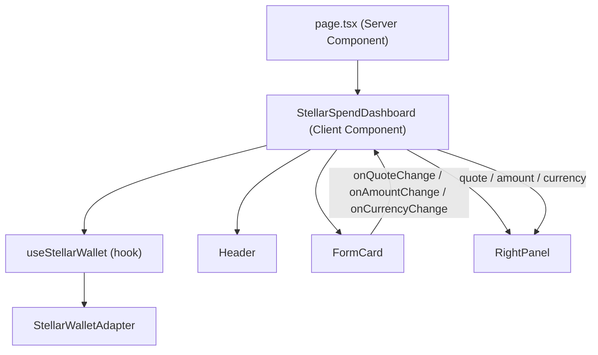

# Design Document: Dashboard Page Setup

## Overview

This feature replaces the placeholder `src/app/page.tsx` with the real Stellar-Spend off-ramp dashboard and updates `src/app/layout.tsx` with accurate metadata including Open Graph tags.

The work involves two distinct changes:

1. **New component** — `StellarSpendDashboard` (`src/components/StellarSpendDashboard.tsx`): a `"use client"` component that owns wallet state via `useStellarWallet` and wires it to `Header`, `FormCard`, and `RightPanel`.
2. **Page wiring** — `src/app/page.tsx` becomes a thin server component that renders `<StellarSpendDashboard />` as its sole child.
3. **Metadata update** — `src/app/layout.tsx` gains a complete `Metadata` export with title, description, and Open Graph fields.

---

## Architecture

The dashboard follows Next.js App Router conventions: the root page is a server component that delegates all interactivity to a single client component boundary.



State flows in one direction: `useStellarWallet` provides wallet state upward to `StellarSpendDashboard`, which distributes it downward as props to the three sub-components. `FormCard` lifts quote/amount/currency changes back up via callbacks so `RightPanel` stays in sync.

---

## Components and Interfaces

### `StellarSpendDashboard`

**File:** `src/components/StellarSpendDashboard.tsx`

```ts
// No external props — self-contained
export default function StellarSpendDashboard(): JSX.Element
```

Internal state managed by this component:

| State variable | Type | Purpose |
|---|---|---|
| `quote` | `QuoteResult \| null` | Latest quote from FormCard, forwarded to RightPanel |
| `amount` | `string` | Current USDC amount, forwarded to RightPanel |
| `currency` | `string` | Selected payout currency, forwarded to RightPanel |
| `resetKey` | `number` | Incremented after successful submit to reset FormCard |

Wallet state is sourced entirely from `useStellarWallet`:

| Value | Type | Usage |
|---|---|---|
| `isConnected` | `boolean` | Passed to Header, FormCard, RightPanel |
| `isConnecting` | `boolean` | Passed to Header, FormCard, RightPanel |
| `wallet.publicKey` | `string \| undefined` | Passed as `walletAddress` to Header |
| `connect` | `() => Promise<StellarWallet>` | Passed as `onConnect` to Header, FormCard, RightPanel |
| `disconnect` | `() => void` | Passed as `onDisconnect` to Header |

**Props passed to `Header`:**

```ts
{
  subtitle: "STABLECOIN OFF-RAMP",
  isConnected,
  isConnecting,
  walletAddress: wallet?.publicKey,
  onConnect: connect,
  onDisconnect: disconnect,
}
```

Note: `stellarUsdcBalance`, `stellarXlmBalance`, and `isBalanceLoading` are optional on `HeaderProps` and will be omitted in the initial implementation (balance fetching is out of scope for this feature).

**Props passed to `FormCard`:**

```ts
{
  isConnected,
  isConnecting,
  resetKey,
  onConnect: connect,
  onSubmit: handleSubmit,
  onQuoteChange: setQuote,
  onAmountChange: setAmount,
  onCurrencyChange: setCurrency,
}
```

**Props passed to `RightPanel`:**

```ts
{
  isConnected,
  isConnecting,
  quote,
  amount,
  currency,
  isLoadingQuote: false,   // RightPanel manages its own loading display via quote === null
  onConnect: connect,
}
```

**`handleSubmit` implementation:**

The `onSubmit` callback received from `FormCard` triggers the full offramp flow. For this feature scope, `handleSubmit` will log the payload and increment `resetKey` on success. The actual transaction execution (bridge + payout) is handled by existing API routes and is outside this feature's scope.

```ts
async function handleSubmit(payload: OfframpPayload): Promise<void> {
  // Placeholder: real execution wired in a future feature
  console.log("Offramp payload:", payload);
  setResetKey((k) => k + 1);
}
```

---

### `page.tsx` (updated)

**File:** `src/app/page.tsx`

Becomes a minimal server component:

```tsx
import StellarSpendDashboard from "@/components/StellarSpendDashboard";

export default function Page() {
  return <StellarSpendDashboard />;
}
```

No layout wrapper is added here — the existing `RootLayout` in `layout.tsx` already provides the `<html>` and `<body>` tags with font variables.

---

### `layout.tsx` (updated)

**File:** `src/app/layout.tsx`

The `metadata` export is expanded:

```ts
export const metadata: Metadata = {
  title: "Stellar-Spend — Convert Stablecoins to Fiat",
  description:
    "Stellar-Spend is a non-custodial off-ramp that converts Stellar USDC to local fiat currencies. Connect your Stellar wallet, enter payout details, and settle directly to your bank account.",
  openGraph: {
    title: "Stellar-Spend — Convert Stablecoins to Fiat",
    description:
      "Stellar-Spend is a non-custodial off-ramp that converts Stellar USDC to local fiat currencies. Connect your Stellar wallet, enter payout details, and settle directly to your bank account.",
    type: "website",
    url: process.env.NEXT_PUBLIC_APP_URL,   // optional; omitted when undefined
  },
};
```

The `url` field is conditionally included: Next.js silently omits `undefined` values from the rendered meta tags, so no runtime guard is needed.

---

## Data Models

### `QuoteResult` (existing, from `FormCard.tsx`)

```ts
interface QuoteResult {
  destinationAmount: string;
  rate: number;
  currency: string;
  bridgeFee: string;
  payoutFee: string;
  estimatedTime: number;
}
```

`StellarSpendDashboard` stores a `QuoteResult | null` in state and passes it directly to `RightPanel`. No transformation is needed.

### `OfframpPayload` (existing, from `FormCard.tsx`)

```ts
interface OfframpPayload {
  amount: string;
  currency: string;
  institution: string;
  accountIdentifier: string;
  accountName: string;
  feeMethod: "USDC" | "XLM";
  quote: QuoteResult;
}
```

Passed from `FormCard` to `StellarSpendDashboard.handleSubmit` on form submission.

### `StellarWallet` (existing, from `wallet-adapter.ts`)

```ts
interface StellarWallet {
  type: "freighter" | "lobstr";
  publicKey: string;
  isConnected: boolean;
}
```

`wallet?.publicKey` is forwarded to `Header` as `walletAddress`.

### Metadata shape (Next.js `Metadata`)

```ts
{
  title: string;
  description: string;
  openGraph: {
    title: string;
    description: string;
    type: "website";
    url?: string;
  };
}
```

---


## Correctness Properties

*A property is a characteristic or behavior that should hold true across all valid executions of a system — essentially, a formal statement about what the system should do. Properties serve as the bridge between human-readable specifications and machine-verifiable correctness guarantees.*

### Property 1: Dashboard renders all sub-components

*For any* render of `StellarSpendDashboard`, the output must contain `Header`, `FormCard`, and `RightPanel` as descendants.

**Validates: Requirements 1.1, 1.2**

---

### Property 2: Wallet state is forwarded to all child components

*For any* combination of `isConnected`, `isConnecting`, and `walletAddress` values returned by `useStellarWallet`, `StellarSpendDashboard` must pass those exact values to `Header`, `FormCard`, and `RightPanel` as their respective props.

**Validates: Requirements 2.5, 2.6, 2.7**

---

### Property 3: Form state changes propagate to RightPanel

*For any* value emitted by `FormCard` via `onQuoteChange`, `onAmountChange`, or `onCurrencyChange`, `RightPanel` must subsequently receive that same value as its corresponding prop (`quote`, `amount`, or `currency`).

**Validates: Requirements 2.8, 2.9, 2.10**

---

### Property 4: Open Graph metadata is consistent with page metadata

*For any* `Metadata` object exported from `layout.tsx`, `openGraph.title` must equal `title` and `openGraph.description` must equal `description`.

**Validates: Requirements 5.2, 5.3**

---

## Error Handling

### Render errors in `StellarSpendDashboard`

`page.tsx` does not wrap `StellarSpendDashboard` in a React `ErrorBoundary`. Any unhandled render error thrown by `StellarSpendDashboard` or its children will propagate up to the nearest Next.js error boundary (the root `error.tsx` if present, or the framework's default error page). This is intentional — the feature does not introduce new error recovery logic.

### Wallet connection errors

`useStellarWallet` already handles connection errors internally, setting an `error` string and re-throwing. `StellarSpendDashboard` does not need to catch these; `Header` and `FormCard` display appropriate disabled/loading states when `isConnecting` is true.

### Missing `NEXT_PUBLIC_APP_URL`

When the environment variable is not set, `openGraph.url` will be `undefined`. Next.js omits `undefined` metadata fields from the rendered HTML, so no `og:url` tag will appear. This is acceptable behavior — the other OG tags remain valid.

### Quote and account verification errors

These are handled entirely within `FormCard` (existing implementation). `StellarSpendDashboard` only receives the final resolved `QuoteResult` via `onQuoteChange`; it never sees intermediate errors.

---

## Testing Strategy

### Dual Testing Approach

Both unit tests and property-based tests are used. Unit tests cover specific examples and integration points; property-based tests verify universal properties across generated inputs.

### Unit Tests

Focus areas:

- **`page.tsx`**: Render the page and assert `StellarSpendDashboard` is present (Requirement 1.1 / Property 1).
- **`layout.tsx` metadata**: Import the `metadata` export and assert exact field values for title, description, `openGraph.type`, and `openGraph.title`/`openGraph.description` consistency (Requirements 3.1, 4.1, 5.1, 5.4).
- **`StellarSpendDashboard` connect/disconnect**: Mock `useStellarWallet`, render the component, simulate button clicks, and assert `connect`/`disconnect` were called (Requirements 2.3, 2.4).
- **Error propagation edge case**: Mock `StellarSpendDashboard` to throw during render and assert the error is not swallowed by `page.tsx` (Requirement 1.3).
- **OG URL edge case**: Assert that when `NEXT_PUBLIC_APP_URL` is undefined, `openGraph.url` is also undefined (Requirement 5.5).

### Property-Based Tests

Property-based testing library: **fast-check** (already compatible with the TypeScript/Jest/Vitest ecosystem used in Next.js projects).

Each property test runs a minimum of **100 iterations**.

---

**Property 1: Dashboard renders all sub-components**

```
// Feature: dashboard-page-setup, Property 1: Dashboard renders all sub-components
fc.assert(
  fc.property(
    fc.record({ isConnected: fc.boolean(), isConnecting: fc.boolean(), publicKey: fc.option(fc.string()) }),
    (walletState) => {
      // Mock useStellarWallet with generated state
      // Render StellarSpendDashboard
      // Assert Header, FormCard, RightPanel are all present in the output
    }
  ),
  { numRuns: 100 }
);
```

---

**Property 2: Wallet state is forwarded to all child components**

```
// Feature: dashboard-page-setup, Property 2: Wallet state is forwarded to all child components
fc.assert(
  fc.property(
    fc.record({
      isConnected: fc.boolean(),
      isConnecting: fc.boolean(),
      publicKey: fc.option(fc.string({ minLength: 56, maxLength: 56 })),
    }),
    (walletState) => {
      // Mock useStellarWallet to return walletState
      // Render StellarSpendDashboard
      // Assert Header receives isConnected, isConnecting, walletAddress matching walletState
      // Assert FormCard receives isConnected, isConnecting matching walletState
      // Assert RightPanel receives isConnected, isConnecting matching walletState
    }
  ),
  { numRuns: 100 }
);
```

---

**Property 3: Form state changes propagate to RightPanel**

```
// Feature: dashboard-page-setup, Property 3: Form state changes propagate to RightPanel
fc.assert(
  fc.property(
    fc.record({
      amount: fc.string(),
      currency: fc.string({ minLength: 3, maxLength: 3 }),
      quote: fc.option(fc.record({
        destinationAmount: fc.string(),
        rate: fc.float({ min: 0 }),
        currency: fc.string(),
        bridgeFee: fc.string(),
        payoutFee: fc.string(),
        estimatedTime: fc.nat(),
      })),
    }),
    ({ amount, currency, quote }) => {
      // Render StellarSpendDashboard
      // Simulate FormCard calling onAmountChange(amount), onCurrencyChange(currency), onQuoteChange(quote)
      // Assert RightPanel receives amount, currency, quote matching the emitted values
    }
  ),
  { numRuns: 100 }
);
```

---

**Property 4: Open Graph metadata is consistent with page metadata**

```
// Feature: dashboard-page-setup, Property 4: Open Graph metadata is consistent with page metadata
fc.assert(
  fc.property(fc.constant(metadata), (meta) => {
    // Assert meta.openGraph.title === meta.title
    // Assert meta.openGraph.description === meta.description
  }),
  { numRuns: 100 }
);
```

Note: Since `metadata` is a static object, this property effectively runs as a single example. The `fc.constant` wrapper keeps it consistent with the property-based test format and allows future parameterization if metadata generation is added.
