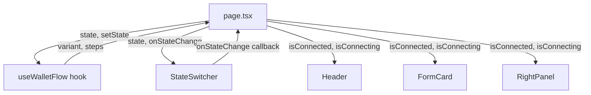

# Design Document: StateSwitcher

## Overview

The StateSwitcher is a development/demo-only tab-bar component that lets developers
and reviewers manually cycle through the three `WalletFlowState` values
(`"pre_connect"`, `"connecting"`, `"connected"`) without a real Stellar wallet.

It is a **controlled, stateless component**: it owns no internal state, receives the
current state and a change handler as props, and delegates all rendering decisions to
those props. Visibility is gated at render time by checking `NODE_ENV` and the
`NEXT_PUBLIC_ENABLE_STATE_SWITCHER` environment variable.

The component slots into the existing dashboard layout (`src/app/page.tsx`) above or
below the main content area and wires directly into the `useWalletFlow` hook that
already drives the rest of the UI.

---

## Architecture



The page holds the single source of truth (`WalletFlowState`). StateSwitcher reads
it via the `state` prop and writes back via `onStateChange`. No new global state or
context is introduced.

---

## Components and Interfaces

### `StateSwitcher` (`src/components/StateSwitcher.tsx`)

```ts
export interface StateSwitcherProps {
  /** Currently active wallet flow state — determines which tab is highlighted. */
  state: WalletFlowState;
  /** Called with the new state when a tab is clicked or activated via keyboard. */
  onStateChange: (state: WalletFlowState) => void;
}
```

**Visibility guard** (evaluated at the top of the render function):

```ts
const isDev = process.env.NODE_ENV === "development";
const flagEnabled = process.env.NEXT_PUBLIC_ENABLE_STATE_SWITCHER === "true";
if (!isDev && !flagEnabled) return null;
```

**Tab definitions** (static, defined outside the component):

```ts
const TABS: Array<{ label: string; value: WalletFlowState }> = [
  { label: "Pre Connect", value: "pre_connect" },
  { label: "Connecting",  value: "connecting"  },
  { label: "Connected",   value: "connected"   },
];
```

**Keyboard navigation** is handled via an `onKeyDown` handler on each `<button>`.
`ArrowRight` / `ArrowLeft` compute the next index with wrap-around and call
`element.focus()` on the target button via a `refs` array. `Enter` / `Space` invoke
`onStateChange` (the browser fires `click` on `Space` for buttons natively, but we
handle it explicitly for clarity).

**ARIA roles**:
- Container `<div>` → `role="tablist"`
- Each `<button>` → `role="tab"`, `aria-selected={isActive}`

### Integration in `page.tsx`

```tsx
const { state, setState, variant, steps } = useWalletFlow("pre_connect");

// Derive boolean flags consumed by existing components
const isConnected  = state === "connected";
const isConnecting = state === "connecting";

// ...

<StateSwitcher state={state} onStateChange={setState} />
```

No changes are required to `Header`, `FormCard`, or `RightPanel` — they already
accept `isConnected` / `isConnecting` booleans.

---

## Data Models

No new data models are introduced. The component relies entirely on the existing
`WalletFlowState` union type from `src/types/stellaramp.ts`:

```ts
export type WalletFlowState = "pre_connect" | "connecting" | "connected";
```

The static `TABS` array (defined inside `StateSwitcher.tsx`) is the only new
data structure, and it is a plain constant — not persisted or shared.

**Environment variables** (already declared in `.env.example` or to be added):

| Variable | Type | Purpose |
|---|---|---|
| `NODE_ENV` | runtime | Standard Next.js env; `"development"` enables the component |
| `NEXT_PUBLIC_ENABLE_STATE_SWITCHER` | `"true"` \| unset | Opt-in flag for non-dev environments |

---

## Correctness Properties

*A property is a characteristic or behavior that should hold true across all valid executions of a system — essentially, a formal statement about what the system should do. Properties serve as the bridge between human-readable specifications and machine-verifiable correctness guarantees.*

### Property 1: Always renders exactly three tabs

*For any* valid `WalletFlowState` passed as the `state` prop, the StateSwitcher SHALL
render exactly three `<button role="tab">` elements with labels "Pre Connect",
"Connecting", and "Connected" in that order.

**Validates: Requirements 1.1, 1.4**

---

### Property 2: Active tab invariant

*For any* `WalletFlowState` value passed as the `state` prop, exactly one tab SHALL
have `aria-selected="true"` and the gold active styles (`bg-[#c9a962]`, dark text),
and all other tabs SHALL have `aria-selected="false"` and the muted inactive styles
(transparent background, `#777777` text).

**Validates: Requirements 2.1, 2.2, 2.3, 2.4, 6.1, 6.3**

---

### Property 3: Click fires onStateChange with correct value

*For any* tab in the StateSwitcher (whether or not it is currently active), clicking
it SHALL invoke `onStateChange` exactly once with the `WalletFlowState` value that
corresponds to that tab's label.

**Validates: Requirements 3.1, 3.3**

---

### Property 4: Arrow key navigation wraps correctly

*For any* tab that currently has focus, pressing `ArrowRight` SHALL move focus to the
tab at index `(currentIndex + 1) % 3`, and pressing `ArrowLeft` SHALL move focus to
the tab at index `(currentIndex + 2) % 3` — both wrapping around the ends of the list.

**Validates: Requirements 4.1, 4.2**

---

### Property 5: Enter and Space activate the focused tab

*For any* tab that currently has focus, pressing `Enter` or `Space` SHALL invoke
`onStateChange` with that tab's `WalletFlowState` value.

**Validates: Requirements 4.3**

---

## Error Handling

The StateSwitcher has a narrow surface area and no async operations, so error
scenarios are limited:

| Scenario | Handling |
|---|---|
| `state` prop is an unrecognised string | No tab will match; all tabs render as inactive. No crash. TypeScript prevents this at compile time. |
| `onStateChange` is not provided | TypeScript enforces the prop as required; omitting it is a compile-time error. |
| Component rendered in production without flag | Returns `null` silently — no error boundary needed. |
| Focus management when component unmounts mid-navigation | Browser handles focus loss naturally; no cleanup required. |

---

## Testing Strategy

### Dual Testing Approach

Both unit tests and property-based tests are used. Unit tests cover specific examples
and environment-gating behaviour; property-based tests verify universal invariants
across all three states and all tab indices.

### Property-Based Testing

**Library**: [`fast-check`](https://github.com/dubzzz/fast-check) (already compatible
with the project's TypeScript/Jest or Vitest setup).

Each property test runs a minimum of **100 iterations**.

Each test is tagged with a comment in the format:
`// Feature: state-switcher, Property N: <property text>`

| Property | Test description | Arbitrary |
|---|---|---|
| Property 1 | For any WalletFlowState, render produces exactly 3 tabs with correct labels | `fc.constantFrom("pre_connect", "connecting", "connected")` |
| Property 2 | For any WalletFlowState, exactly one tab is active (aria-selected + styles) | same |
| Property 3 | For any tab index (0–2), clicking it calls onStateChange with the right value | `fc.integer({ min: 0, max: 2 })` |
| Property 4 | For any focused tab index and direction (left/right), focus lands on the correct next index | `fc.integer({ min: 0, max: 2 })` × `fc.constantFrom("ArrowLeft", "ArrowRight")` |
| Property 5 | For any focused tab index and activation key (Enter/Space), onStateChange is called with the right value | `fc.integer({ min: 0, max: 2 })` × `fc.constantFrom("Enter", " ")` |

### Unit Tests (Examples)

- Renders `null` when `NODE_ENV === "production"` and flag is unset (Requirement 5.2)
- Renders when `NODE_ENV === "development"` (Requirement 5.1)
- Renders when `NEXT_PUBLIC_ENABLE_STATE_SWITCHER === "true"` regardless of `NODE_ENV` (Requirement 5.3)
- Tab container has `role="tablist"` (Requirement 1.3)
- All tabs are focusable (no `tabIndex=-1`, no `disabled`) (Requirement 4.4)
- Label-to-value mapping: clicking "Pre Connect" → `"pre_connect"`, etc. (Requirement 1.2)
