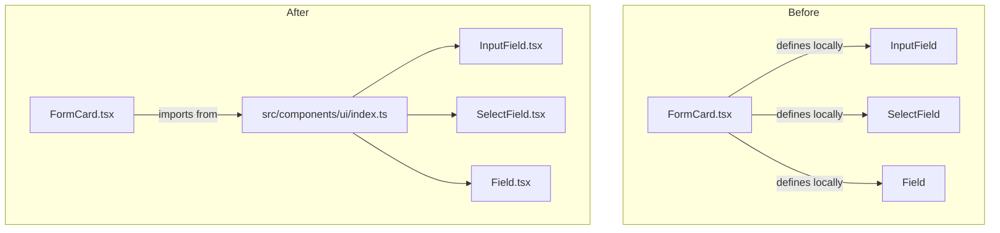

# Design Document: UI Form Primitives

## Overview

Extract three reusable form primitive components — `InputField`, `SelectField`, and `Field` — from the monolithic `FormCard` component into `src/components/ui/`. Each primitive is a self-contained, fully-typed React component that shares a consistent visual language driven entirely by CSS custom properties defined in `globals.css`. After extraction, `FormCard` is refactored to import from `src/components/ui/` rather than defining these components locally.

The project is a Next.js 15 / React 19 application written in TypeScript with Tailwind CSS v4. No new runtime dependencies are required; the extraction is purely a structural refactor.

## Architecture

The change is a pure extraction — no new data flows, no new API calls, no new state. The dependency graph shifts as follows:



File layout after extraction:

```
src/components/ui/
  index.ts          ← barrel export
  InputField.tsx
  SelectField.tsx
  Field.tsx
```

`FormCard.tsx` continues to own all business logic (state, API calls, validation). The primitives are purely presentational.

## Components and Interfaces

### InputField

Renders a labeled `<input>` with an optional inline suffix, error state, and disabled state.

```typescript
export interface InputFieldProps {
  label: string;
  id: string;
  value: string;
  onChange: (value: string) => void;
  type?: string;
  placeholder?: string;
  disabled?: boolean;
  suffix?: string;
  error?: string;
  // Numeric / text variants
  inputMode?: "numeric" | "decimal" | "text";
  min?: string;
  step?: string;
  maxLength?: number;
}
```

Key rendering rules:
- `<label>` uses `var(--muted)` color, uppercase, 10px, `0.18em` letter-spacing.
- `<input>` uses `var(--line)` border, `var(--bg)` background, IBM Plex Mono font, `min-h-[46px]`.
- `focus-visible` ring uses `var(--accent)`.
- When `suffix` is provided, the input gains `pr-20` and the suffix is absolutely positioned right.
- When `error` is provided, border becomes `red-500/60` and an error message renders below.
- When `disabled`, `opacity-40` and `cursor-not-allowed` are applied.

### SelectField

Renders a labeled native `<select>` with a custom chevron SVG, loading state, and disabled state.

```typescript
export interface SelectFieldProps {
  label: string;
  id: string;
  value: string;
  onChange: (value: string) => void;
  options: Array<{ value: string; label: string }>;
  placeholder?: string;
  disabled?: boolean;
  loading?: boolean;
}
```

Key rendering rules:
- `<label>` identical to `InputField` label.
- `<select>` uses `appearance-none`, `var(--line)` border, `var(--bg)` background, IBM Plex Mono, `min-h-[46px]`.
- A custom chevron SVG (`<svg>` with a downward chevron path) is absolutely positioned on the right, replacing the native browser arrow.
- When `loading` is `true`, the select is disabled and the placeholder option reads "Loading...".
- When `value` is non-empty, text is `var(--text)`; when empty, placeholder is `var(--muted)`.
- `focus-visible` ring uses `var(--accent)`.

### Field

Renders a labeled read-only display container with configurable tone.

```typescript
export type FieldTone = "muted" | "accent";

export interface FieldProps {
  label: string;
  value: string;
  tone?: FieldTone;        // defaults to "muted"
  loading?: boolean;
  placeholder?: string;    // defaults to "—"
}
```

Key rendering rules:
- `<span>` label identical to `InputField` label.
- Display container uses `var(--line)` border, `var(--bg)` background, IBM Plex Mono, `min-h-[46px]`.
- When `loading` is `true`, renders "Resolving..." in `var(--muted)`.
- When `value` is non-empty and `tone === "accent"`, renders in `var(--accent)`.
- When `value` is non-empty and `tone === "muted"` (or omitted), renders in `var(--muted)`.
- When `value` is empty and not loading, renders `placeholder` in `var(--muted)`.

### Barrel Export (`src/components/ui/index.ts`)

```typescript
export { InputField } from "./InputField";
export type { InputFieldProps } from "./InputField";

export { SelectField } from "./SelectField";
export type { SelectFieldProps } from "./SelectField";

export { Field } from "./Field";
export type { FieldProps, FieldTone } from "./Field";
```

## Data Models

No new data models are introduced. The only data structures are the TypeScript prop interfaces defined above. The `options` array type used by `SelectField` is an inline `Array<{ value: string; label: string }>` — no separate type alias is needed since it is fully described by `SelectFieldProps`.

Design token reference (from `globals.css`):

| Token | Value | Usage |
|---|---|---|
| `var(--bg)` | `#0a0a0a` | Input/select/field background |
| `var(--line)` | `#333333` | Border color |
| `var(--muted)` | `#777777` | Labels, placeholder text, muted tone |
| `var(--accent)` | `#c9a962` | Focus ring, accent tone, error border |
| `var(--text)` | `#ffffff` | Selected value text in SelectField |

Font: `var(--font-ibm-plex-mono)` (mapped in `globals.css` `@theme` block to the Next.js font variable `--font-ibm-plex-mono-source`).


## Correctness Properties

*A property is a characteristic or behavior that should hold true across all valid executions of a system — essentially, a formal statement about what the system should do. Properties serve as the bridge between human-readable specifications and machine-verifiable correctness guarantees.*

### Property 1: Label styling is consistent across all three primitives

*For any* valid props passed to `InputField`, `SelectField`, or `Field`, the rendered label element must carry the classes that produce `var(--muted)` color, uppercase transform, 10px font size, and `0.18em` letter-spacing (e.g. `text-[10px] tracking-[0.18em] text-[var(--muted)] uppercase`).

**Validates: Requirements 1.2, 2.2, 3.2**

---

### Property 2: Container base styling is consistent across all three primitives

*For any* valid props passed to `InputField`, `SelectField`, or `Field`, the interactive/display container element must carry classes that apply `var(--line)` border, `var(--bg)` background, IBM Plex Mono font, and a minimum height of 46px.

**Validates: Requirements 1.3, 2.3, 3.3, 4.2, 4.3**

---

### Property 3: InputField suffix is rendered when provided

*For any* `InputFieldProps` where `suffix` is a non-empty string, the rendered output must contain a span element with that exact suffix text and the `var(--muted)` color class; when `suffix` is absent, no such span should be present.

**Validates: Requirements 1.4**

---

### Property 4: InputField error state changes border and shows message

*For any* `InputFieldProps` where `error` is a non-empty string, the input element must carry the `border-red-500/60` class and the rendered output must contain an element displaying that exact error string; when `error` is absent, neither the error border class nor the error element should be present.

**Validates: Requirements 1.5**

---

### Property 5: Disabled state applies opacity and cursor classes

*For any* `InputFieldProps` or `SelectFieldProps` where `disabled` is `true`, the input/select element must carry `opacity-40` and `cursor-not-allowed`; when `disabled` is `false` or absent, those classes must not be present.

**Validates: Requirements 1.6, 2.6**

---

### Property 6: SelectField always renders a chevron SVG

*For any* valid `SelectFieldProps`, the rendered output must contain an SVG element positioned on the right side of the select, regardless of the values of other props.

**Validates: Requirements 2.4**

---

### Property 7: SelectField loading state disables select and shows "Loading..."

*For any* `SelectFieldProps` where `loading` is `true`, the select element must be disabled and the first option element must have the text "Loading..."; when `loading` is `false`, the placeholder option must show the provided `placeholder` text (or the default).

**Validates: Requirements 2.5**

---

### Property 8: SelectField value presence determines text color class

*For any* `SelectFieldProps` where `value` is a non-empty string, the select element must carry the `var(--text)` color class; when `value` is an empty string, the select element must carry the `var(--muted)` color class.

**Validates: Requirements 2.7**

---

### Property 9: Field tone determines value text color

*For any* `FieldProps` where `value` is non-empty and `loading` is `false`: when `tone` is `"accent"`, the value element must carry the `var(--accent)` color class; when `tone` is `"muted"` or omitted, the value element must carry the `var(--muted)` color class.

**Validates: Requirements 3.4, 3.5**

---

### Property 10: Field loading state shows "Resolving..." instead of value

*For any* `FieldProps` where `loading` is `true`, the rendered output must contain the text "Resolving..." styled in `var(--muted)` and must not render the `value` prop text.

**Validates: Requirements 3.6**

---

### Property 11: Field empty value renders placeholder

*For any* `FieldProps` where `value` is an empty string and `loading` is `false`, the rendered output must display the `placeholder` prop text (defaulting to `"—"`) in `var(--muted)` color.

**Validates: Requirements 3.7**

---

### Property 12: Focus-visible ring uses accent color on all three primitives

*For any* valid props passed to `InputField`, `SelectField`, or `Field`, the interactive element must carry a `focus-visible` ring class referencing `var(--accent)`.

**Validates: Requirements 4.4**

---

## Error Handling

These are purely presentational components with no async operations or external dependencies. Error handling is limited to:

- **Invalid / missing props**: TypeScript enforces required props at compile time. No runtime guards are needed.
- **`error` prop on `InputField`**: The component renders the error message as provided by the caller. It does not validate or transform the string.
- **`loading` prop on `SelectField` and `Field`**: The component renders a loading placeholder; the caller is responsible for setting `loading` back to `false` when data arrives.
- **Empty `options` array on `SelectField`**: The select renders with only the placeholder option. No error state is shown — the caller decides whether to show a loading or disabled state.
- **Unknown `tone` value on `Field`**: TypeScript's union type `"muted" | "accent"` prevents invalid values at compile time. No runtime fallback is needed.

## Testing Strategy

### Dual Testing Approach

Both unit tests and property-based tests are required. They are complementary:

- **Unit tests** cover specific examples, integration points, and edge cases.
- **Property tests** verify universal invariants across randomly generated inputs.

### Property-Based Testing

Library: **`fast-check`** (TypeScript-native, works with any test runner).

Install: `npm install --save-dev fast-check`

Each property test must run a minimum of **100 iterations** (fast-check default is 100; set explicitly via `{ numRuns: 100 }`).

Each test must include a comment tag in the format:
`// Feature: ui-form-primitives, Property N: <property_text>`

Each correctness property from the design document maps to exactly one property-based test:

| Design Property | Test file | fast-check arbitraries |
|---|---|---|
| P1: Label styling | `InputField.test.tsx`, `SelectField.test.tsx`, `Field.test.tsx` | `fc.record({ label: fc.string(), ... })` |
| P2: Container base styling | same files | same |
| P3: InputField suffix | `InputField.test.tsx` | `fc.string({ minLength: 1 })` for suffix |
| P4: InputField error state | `InputField.test.tsx` | `fc.string({ minLength: 1 })` for error |
| P5: Disabled state | `InputField.test.tsx`, `SelectField.test.tsx` | `fc.boolean()` for disabled |
| P6: SelectField chevron | `SelectField.test.tsx` | full props record |
| P7: SelectField loading | `SelectField.test.tsx` | `fc.boolean()` for loading |
| P8: SelectField value color | `SelectField.test.tsx` | `fc.oneof(fc.constant(""), fc.string({ minLength: 1 }))` |
| P9: Field tone color | `Field.test.tsx` | `fc.constantFrom("muted", "accent")` |
| P10: Field loading | `Field.test.tsx` | `fc.boolean()` for loading |
| P11: Field empty placeholder | `Field.test.tsx` | `fc.string()` for placeholder |
| P12: Focus-visible ring | `InputField.test.tsx`, `SelectField.test.tsx`, `Field.test.tsx` | full props record |

### Unit Tests

Unit tests should focus on:

- **Specific rendering examples**: render `InputField` with a known set of props and assert the exact DOM structure.
- **FormCard integration**: render `FormCard` and assert it uses the extracted primitives (no local re-definitions).
- **Barrel export**: import from `src/components/ui/index.ts` and assert all three components and their prop types are exported.
- **Edge cases**: `suffix` with whitespace-only string, `error` with a very long message, `options` as an empty array, `Field` with `value=""` and no `placeholder` prop (should default to `"—"`).

Unit tests should be kept minimal — property tests handle broad input coverage.

### Test File Locations

```
src/components/ui/__tests__/
  InputField.test.tsx
  SelectField.test.tsx
  Field.test.tsx
  index.test.ts        ← barrel export + FormCard integration
```
